# High-Level Architecture Flowchart

This flowchart provides a bird's-eye view of the LaphriaEngine, illustrating how the major subsystems (Core, SceneManagement, Physics, rendering modes) interact from application startup through the per-frame game loop.

```mermaid
flowchart TD
    A[main.cpp] --> B(EngineCore::run)
    
    subgraph Initialization [1. Initialization Phase]
        B --> initW[initWindow<br/><i>GLFW Setup</i>]
        initW --> initI[initInput<br/><i>InputSystem</i>]
        initI --> initV[initVulkan]

        initV --> vkDev[VulkanDevice::init<br/><i>Instance, Device, Queue, Surface</i>]
        vkDev --> scInit[SwapchainManager::init<br/><i>Swapchain & Image Views</i>]
        scInit --> frInit[FrameContext::init<br/><i>Command Buffers, Sync Objects, UBOs</i>]

        frInit --> initSub[Initialize Core Subsystems]
        initSub --> |Asset Loading| R[ResourceManager]
        initSub --> |Entity Graph| S[Scene Management<br/><i>Nodes & Octree</i>]
        initSub --> |Collision/Dynamics| P[PhysicsSystem]
        initSub --> |Shaders/Layouts| Pips[PipelineCollection]

        Pips --> initUI[initImgui<br/><i>UISystem Setup</i>]
    end
    
    subgraph MainLoop [2. Main Engine Loop Phase]
        initUI --> loop((mainLoop))
        
        loop --> poll[Poll Events & Camera Update]
        poll --> phys[Physics Update]
        
        phys --> physGPU{GPU Physics?}
        physGPU -- Yes --> physSSBO[Dispatch CS<br/><i>PhysicsSystem::updateGPU</i>]
        physSSBO -.-> sync[Sync from GPU<br/><i>PhysicsSystem::syncFromGPU</i>]
        sync --> ui[UI New Frame & Scene Introspection]
        
        physGPU -- No --> physCPU[CPU Fixed Update<br/><i>PhysicsSystem::updateCPU</i>]
        physCPU --> ui
        
        ui --> draw([EngineCore::drawFrame])
    end
    
    subgraph FrameExecution [3. Frame Submission Pipeline]
        draw --> fence[Wait For Fences]
        fence --> acq[Acquire Swapchain Image]
        acq --> acqResult{Acquire Result}
        acqResult -- eErrorOutOfDateKHR --> recreate[recreateSwapChain]
        recreate -.-> loop
        acqResult -- Success --> updateUBO[Update Uniform Buffers]

        updateUBO --> tlasCheck{RT / PT Mode?}
        tlasCheck -- Yes --> tlas[Build Active Scene TLAS<br/><i>Gather BLAS + Transforms</i>]
        tlas --> route{Render Mode?}
        tlasCheck -- No --> route

        %% Render Modes Routing
        route -- Rasterizer --> raster[(Raster Pipes)]
        raster --> shadow[Shadow Cascade Pass]
        shadow --> starfield[Starfield Compute Pass]
        starfield --> mainGeom[Main Geometry Pass<br/><i>Culling + Draw</i>]
        
        route -- Classic RT --> classic[(Ray Tracer)]
        classic --> rtDispatch[Raygen Dispatch]
        rtDispatch --> rtOutput[Copy to Swapchain]
        
        route -- Path Tracer --> pt[(Path Tracer)]
        pt --> ptDispatch[1SPP Raygen Dispatch]
        ptDispatch --> ptReproject[Reprojection CS]
        ptReproject --> ptAtrous[A-Trous Spatial Filter CS]
        ptAtrous --> ptOutput[Copy to Swapchain]
        
        mainGeom --> uiDraw[Render ImGui DrawData]
        rtOutput --> uiDraw
        ptOutput --> uiDraw
        
        uiDraw --> submitFrame[Submit to Vulkan Queue]
        submitFrame --> presentFrame[Present Swapchain Image]
        presentFrame --> presentResult{Present Result}
        presentResult -- eErrorOutOfDateKHR --> recreate
        presentResult -- Success --> loop
    end

    %% Styling
    classDef init fill:#2A4365,stroke:#4299E1,stroke-width:2px,color:#fff
    classDef loop fill:#744210,stroke:#D69E2E,stroke-width:2px,color:#fff
    classDef exec fill:#22543D,stroke:#48BB78,stroke-width:2px,color:#fff
    classDef mode fill:#4A5568,stroke:#A0AEC0,stroke-width:2px,color:#fff,stroke-dasharray: 5 5
    
    class Initialization init
    class MainLoop loop
    class FrameExecution exec
    class raster,classic,pt mode
```

