# Path Tracing (PT) Pipeline Flowchart

This flowchart outlines the rendering path when `RenderMode::PathTracer` is selected. It features the Vulkan hardware-accelerated Ray Tracing pipeline mapping out a 1 Sample-Per-Pixel (SPP) path tracer, followed by a temporal reprojection and spatial A-Trous filtering denoiser compute pass.

```mermaid
flowchart TD
    Start([recordCommandBuffer<br/><i>RenderMode::PathTracer</i>])

    %% TLAS is built in recordCommandBuffer before this path is entered — see high_level_architecture.md
    Start --> tlasPre[TLAS Pre-Built<br/><i>Built in recordCommandBuffer for all RT/PT frames<br/>AS_Write -> RT_Read barrier already applied</i>]

    %% Path Tracing Pass
    subgraph PTPass [Path Tracer 1SPP Dispatch]
        tlasPre --> transGBuffer[Transition Output & GBuffers<br/><i>eGeneral</i>]
        transGBuffer --> bindPT[Bind rayTracingPipeline<br/><i>Raygen, ClosestHit, Miss, AnyHit</i>]
        bindPT --> traceRays[vkCmdTraceRaysKHR<br/><i>1 SPP</i>]
        
        %% Shader Details
        traceRays -.-> raygen[Raygen.slang]
        raygen -.-> |"for (bounces < MAX_BOUNCES)"| loop{Trace Ray}
        loop -.-> chit[ClosestHit.slang<br/><i>Material Eval & Next Ray Update</i>]
        chit -.-> loop
        loop -.-> saveGBuffer[Write to GBuffer<br/><i>Normals, Depth, Motion, Color</i>]
    end
    
    %% Denoiser Passes
    subgraph Denoiser [SVGF Denoiser]
        saveGBuffer --> barrierRTtoCS[Memory Barrier<br/><i>RT_Write -> Compute_Read</i>]
        
        %% Reprojection
        barrierRTtoCS --> camCheck{Camera Moved?}
        camCheck -- Yes --> reproPushMove[DenoisePushConstants<br/><i>phiColor = 1.0 — Discard History</i>]
        camCheck -- No --> reproPushStatic[DenoisePushConstants<br/><i>phiColor = 0.1 — Blend 90% History</i>]
        reproPushMove --> bindReproj[Bind reprojectionPipeline<br/><i>Reprojection.slang</i>]
        reproPushStatic --> bindReproj
        bindReproj --> execReproj[Dispatch Reprojection<br/><i>Combines GBuffer + History</i>]

        execReproj --> barrierCS1[Memory Barrier<br/><i>Compute -> Compute</i>]

        %% A-Trous
        barrierCS1 --> bindATrous[Bind atrousPipeline<br/><i>Denoiser.slang</i>]
        bindATrous --> execATrous{5 Iterations Ping-Ponging}
        
        execATrous --> |"Iter 0..3"| iterRun[Dispatch A-Trous Pass<br/><i>stepSize * 2^i</i>]
        iterRun --> barrierCS2[Memory Barrier]
        barrierCS2 --> execATrous
        
        execATrous --> |"Iter 4 (Last)"| finalATrous[Dispatch A-Trous Pass<br/><i>Writes to rayTracingOutputImages</i>]
    end
    
    %% Presentation
    subgraph SwapchainBlit [Image Blitting & UI]
        finalATrous --> transBlitSrc[Trans. Output Image <br/><i>eTransferSrcOptimal</i>]
        transBlitSrc --> transBlitDst[Trans. Swapchain Image <br/><i>eTransferDstOptimal</i>]
        transBlitDst --> blit[vkCmdBlitImage]
        
        blit --> restoreGeneral[Restore Output Image<br/><i>eGeneral</i>]
        restoreGeneral --> beginRender[beginRendering to Swapchain]
        
        beginRender --> uiPass[ImGui_ImplVulkan_RenderDrawData]
        uiPass --> endRender[endRendering]
    end
    
    %% Styling
    classDef pre fill:#2F855A,stroke:#48BB78,stroke-width:1px,color:#fff,stroke-dasharray: 5 5
    classDef rtexec fill:#9B2C2C,stroke:#F56565,stroke-width:2px,color:#fff
    classDef compute fill:#553C9A,stroke:#9F7AEA,stroke-width:2px,color:#fff
    classDef blit fill:#2B6CB0,stroke:#4299E1,stroke-width:2px,color:#fff
    classDef param fill:#744210,stroke:#D69E2E,stroke-width:1px,color:#fff,stroke-dasharray: 4 4

    class tlasPre pre
    class PTPass rtexec
    class Denoiser compute
    class SwapchainBlit blit
    class raygen,loop,chit,saveGBuffer param
```

