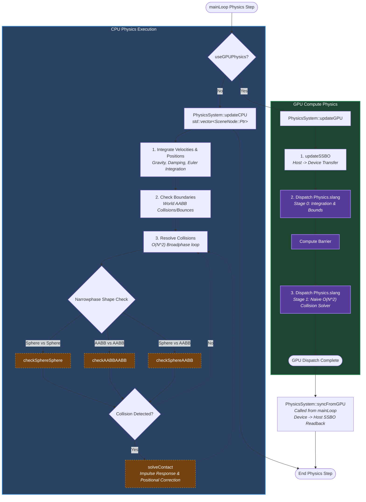

# Physics System Flowchart

This flowchart outlines the physics logic executed per-frame, detailing both the CPU-bound simulation and the GPU-accelerated compute shader experimental path.

```mermaid
flowchart TD
    Start([mainLoop Physics Step]) --> gpuCheck{useGPUPhysics?}
    
    %% CPU Path
    subgraph CPUPhysics [CPU Physics Execution]
        gpuCheck -->|No| cpuUpdate[PhysicsSystem::updateCPU<br/><i>std::vector&lt;SceneNode::Ptr&gt;</i>]
        
        cpuUpdate --> integrate[1. Integrate Velocities & Positions<br/><i>Gravity, Damping, Euler Integration</i>]
        integrate --> bounds[2. Check Boundaries<br/><i>World AABB Collisions/Bounces</i>]
        bounds --> resolve["3. Resolve Collisions<br/><i>O(N^2) Broadphase loop</i>"]
        
        resolve --> narrow{Narrowphase Shape Check}
        narrow -->|"Sphere vs Sphere"| ss[checkSphereSphere]
        narrow -->|"AABB vs AABB"| aa[checkAABBAABB]
        narrow -->|"Sphere vs AABB"| sa[checkSphereAABB]
        
        ss --> solver{Collision Detected?}
        aa --> solver
        sa --> solver
        
        solver -->|Yes| solve[solveContact<br/><i>Impulse Response & Positional Correction</i>]
        solve -.-> resolve
        
        solver -.->|No| resolve
    end
    
    %% GPU Path
    subgraph GPUPhysics [GPU Compute Physics]
        gpuCheck -->|Yes| gpuUpdate[PhysicsSystem::updateGPU]
        
        gpuUpdate --> ssboUpdate[1. updateSSBO<br/><i>Host -> Device Transfer</i>]
        ssboUpdate --> dispatch1[2. Dispatch Physics.slang<br/><i>Stage 0: Integration & Bounds</i>]
        dispatch1 --> barrierCS[Compute Barrier]
        barrierCS --> dispatch2["3. Dispatch Physics.slang<br/><i>Stage 1: Naive O(N^2) Collision Solver</i>"]
        
        dispatch2 --> gpuDone([GPU Dispatch Complete])
    end

    %% syncFromGPU is called by mainLoop (EngineCore) immediately after endSingleTimeCommands,
    %% not from within PhysicsSystem::updateGPU itself.
    gpuDone --> gpuSync[PhysicsSystem::syncFromGPU<br/><i>Called from mainLoop<br/>Device -> Host SSBO Readback</i>]

    %% Final
    cpuUpdate --> End([End Physics Step])
    gpuSync --> End
    
    %% Styling
    classDef cpu fill:#2A4365,stroke:#4299E1,stroke-width:2px,color:#fff
    classDef gpu fill:#1C4532,stroke:#38A169,stroke-width:2px,color:#fff
    classDef compute fill:#553C9A,stroke:#9F7AEA,stroke-width:2px,color:#fff
    classDef solver fill:#744210,stroke:#D69E2E,stroke-width:1px,color:#fff,stroke-dasharray: 4 4
    
    class CPUPhysics cpu
    class GPUPhysics gpu
    class dispatch1,barrierCS,dispatch2 compute
    class ss,aa,sa,solve solver
```
