# Rasterization Pipeline Flowchart

This flowchart details the execution steps when `RenderMode::Rasterizer` is selected. It covers the cascaded shadow map generation, the starfield compute pass, and the main forward-shading graphics pass.

```mermaid
flowchart TD
    Start([recordCommandBuffer<br/><i>RenderMode::Rasterizer</i>])

    %% Cascaded Shadow Map Pass
    Start --> ShadowPass{Cascaded Shadow Pass}
    
    subgraph ShadowMap [Cascaded Shadow Map Generation]
        ShadowPass --> |For layer 0..3| C[Bind shadowPipeline<br/><i>Shadow.slang</i>]
        C --> transShadow[Transition Cascade Image<br/><i>eDepthAttachmentOptimal</i>]
        transShadow --> beginShadow[beginRendering<br/><i>Depth Only</i>]
        
        beginShadow --> bindShadowDesc[Bind Descriptor Set 0: Global]
        bindShadowDesc --> drawShadow{For each SceneNode}
        drawShadow --> |Valid Model| bindMatDescS[Bind Set 1: Model/Material]
        bindMatDescS --> pushShadow[Push Constants<br/><i>CascadeIdx, MVP</i>]
        pushShadow --> drawCallS[vkCmdDrawIndexed]
        drawCallS -.-> drawShadow
        
        drawShadow --> endShadow[endRendering]
        endShadow --> transShadowRead[Transition Shadow Image<br/><i>eShaderReadOnlyOptimal</i>]
    end
    
    %% Compute Pass (Starfield)
    subgraph ComputePass [Starfield Compute Pass]
        transShadowRead --> cpBind[Bind computePipeline<br/><i>Compute.slang</i>]
        cpBind --> cpDesc[Bind Set 0: Compute Output Image]
        cpDesc --> cpDisp[Dispatch Compute Shader]
        cpDisp --> cpSync[Memory Barrier<br/><i>ComputeWrite -> TransferRead</i>]
        cpSync --> cpBlit[Blit Starfield to Swapchain Image]
        cpBlit --> cpRestore[Restore Storage Image<br/><i>eTransferSrc -> eGeneral</i>]
        cpRestore --> cpColorAtt[Transition Swapchain<br/><i>eTransferDst -> eColorAttachmentOptimal</i>]
    end

    %% Main Graphics Pass
    subgraph MainPass [Main Forward Graphics Pass]
        cpColorAtt --> transDepth[Transition Depth Buffer<br/><i>eDepthAttachmentOptimal</i>]
        transDepth --> beginGraphics[beginRendering<br/><i>Color & Depth Targets</i>]
        
        beginGraphics --> bindGraphics[Bind graphicsPipeline<br/><i>LaphriaEngine.slang</i>]
        bindGraphics --> culling[CPU Box Culling]
        
        culling --> bindGlobalDescG[Bind Set 0: Global UBO & Shadows]
        
        bindGlobalDescG --> drawGraphics{For each Visible Node}
        drawGraphics --> |Node in Frustum| bindMatDescG[Bind Set 1: Model/Material]
        bindMatDescG --> pushGraphics[Push Constants<br/><i>MVP, MaterialIdx</i>]
        pushGraphics --> drawCallG[vkCmdDrawIndexed]
        drawCallG -.-> drawGraphics
        
        drawGraphics --> uiPass[ImGui_ImplVulkan_RenderDrawData]
        uiPass --> endGraphics[endRendering]
    end
    
    %% Presentation Transition
    endGraphics --> transPresent[Transition Swapchain Image<br/><i>ePresentSrcKHR</i>]
    transPresent --> End([End Command Buffer Record])
    
    %% Styling
    classDef shadow fill:#2C7A7B,stroke:#38B2AC,stroke-width:2px,color:#fff
    classDef compute fill:#553C9A,stroke:#9F7AEA,stroke-width:2px,color:#fff
    classDef graphics fill:#C05621,stroke:#ED8936,stroke-width:2px,color:#fff
    
    class ShadowMap shadow
    class ComputePass compute
    class MainPass graphics
```

