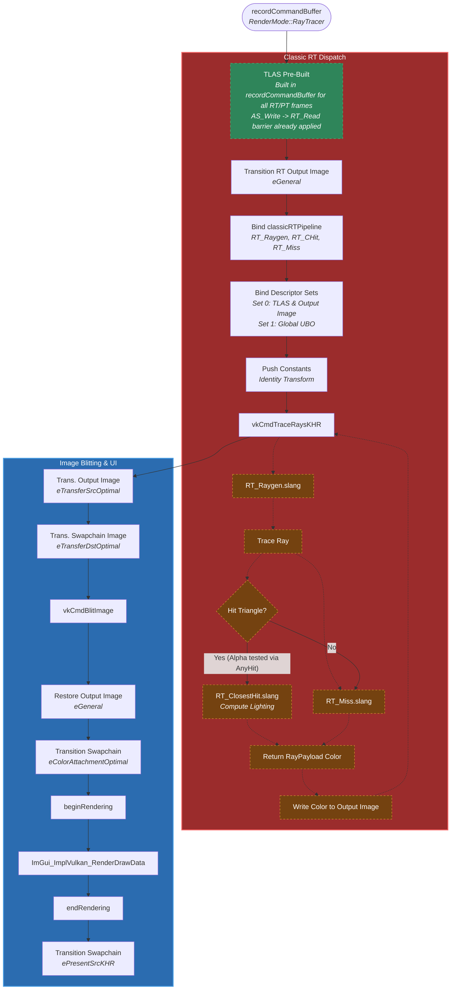

# Ray Tracing (RT) Pipeline Flowchart

This flowchart outlines the rendering path when `RenderMode::RayTracer` is selected. It features the Vulkan hardware-accelerated Ray Tracing pipeline, utilizing the Shader Binding Table (SBT) and the Top-Level Acceleration Structure (TLAS).

