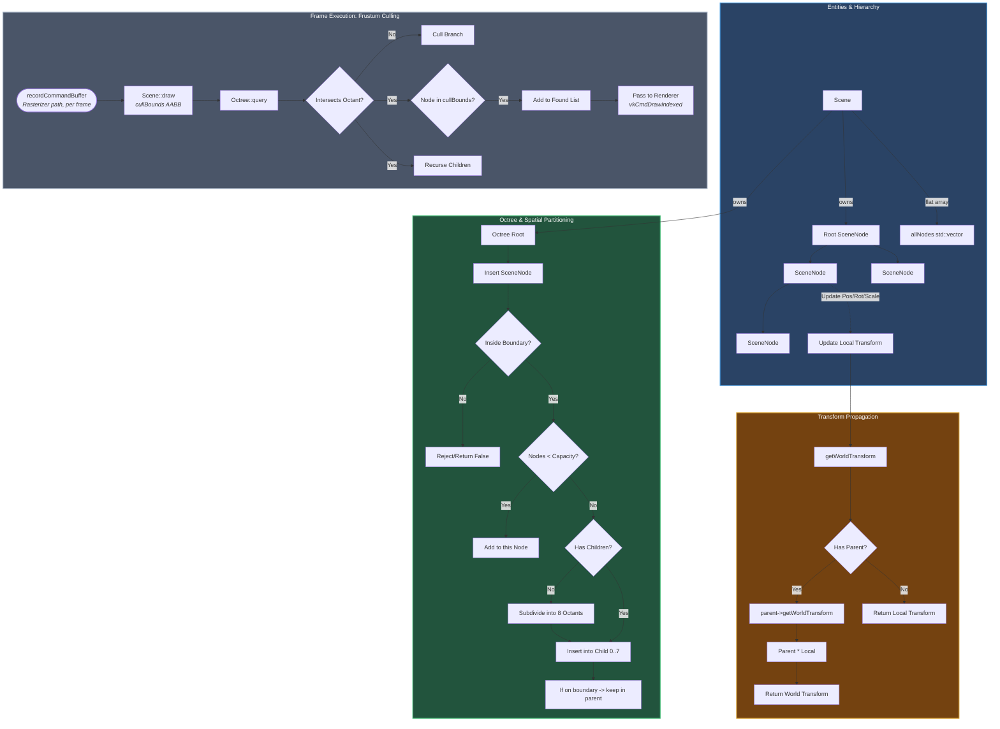

# Scene Management Flowchart

This flowchart visualizes the relationship between the `Scene`, `SceneNode` hierarchy, and the `Octree` spatial partitioning system. It demonstrates how transforms propagate and how nodes are queried for rendering.

